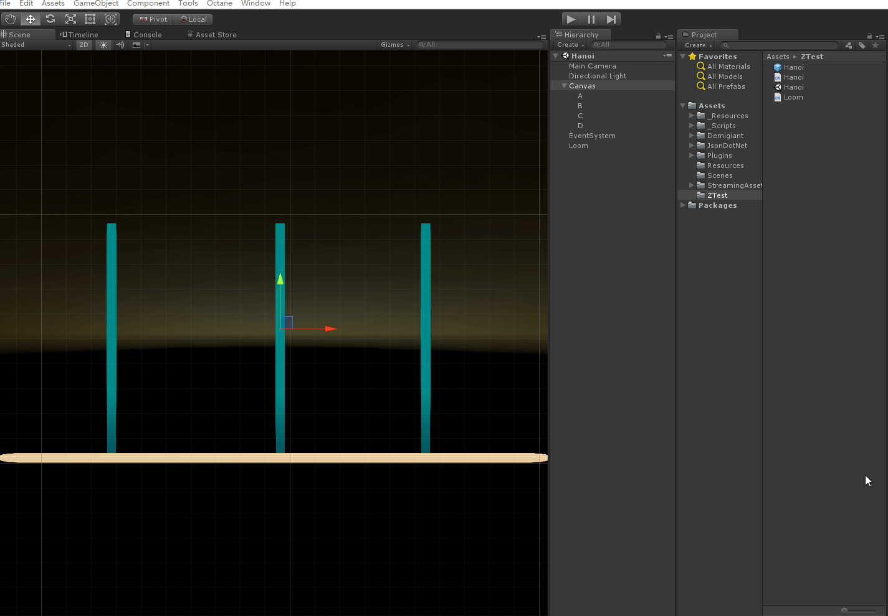

# UnityHanoi-
Unity 制作自动还原汉诺塔
使用插件 DoTween Loom

汉诺塔问题是一个经点递归题目

其解题思路 就是单纯的分解问题
把N个盘子移动到另一个柱子 可以分解成三步

假如三个柱子分别叫A B C 我们想把盘子从A柱子移动到C柱子上 那B柱子就称为辅助柱子

1. 把上面N-1个盘子移动到一个辅助柱子上
2. 把最下面的盘子移动到目标柱子
3. 把第1步移到B柱子上的盘子都移动到C柱子上

是不是发现第三步 和原本的问题是一样的 都是把一堆盘子移动到另一个柱子上 只不过 比第一次少了一个
到最后 就只是移动一个盘子 就简单了 直接移动就好

